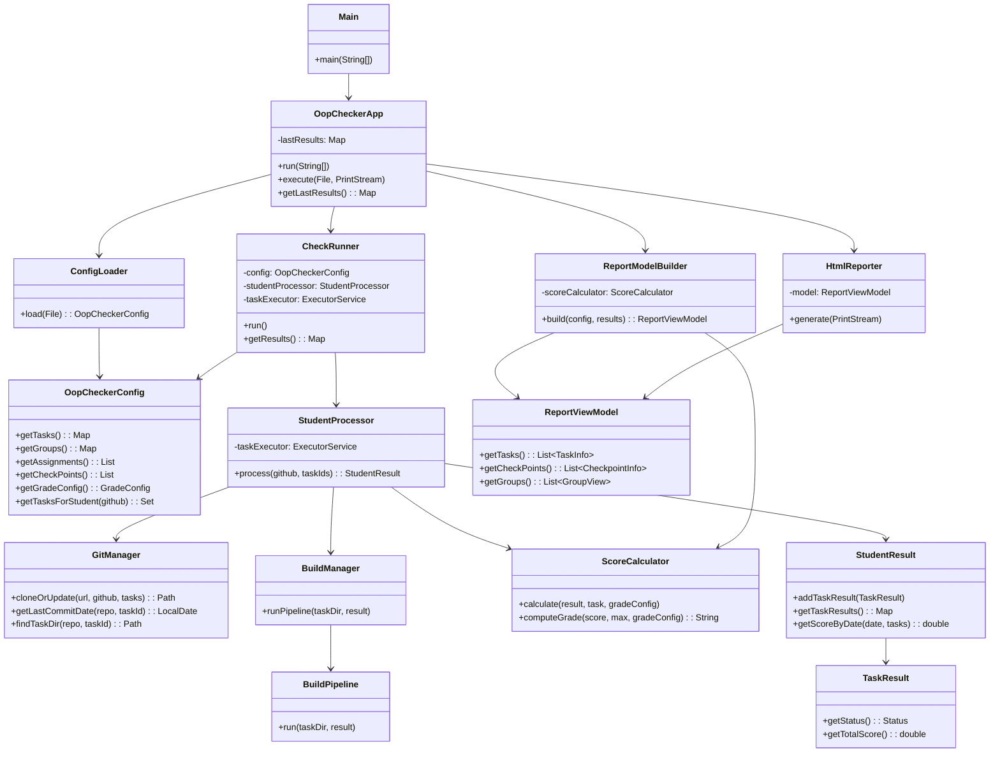

# Architecture: OOP Checker

## Class responsibilities

| Class | Package | Responsibility |
|---|---|---|
| `Main` | root | Entry point. Configures logging, delegates to `OopCheckerApp`. |
| `OopCheckerApp` | root | Application facade. Orchestrates the full pipeline: load config → run checks → build report → render. Exposes `execute(File, PrintStream)` for testability and `run(String[])` for CLI use. |
| `ConfigLoader` | dsl | Evaluates the Groovy DSL script and returns an `OopCheckerConfig`. |
| `OopCheckerDslDelegate` | dsl | Groovy delegate that maps DSL closures (`tasks {}`, `groups {}`, etc.) to `OopCheckerConfig` mutations. |
| `OopCheckerConfig` | dsl | Immutable-ish configuration bag: tasks, groups, assignments, checkpoints, grade settings. |
| `CheckRunner` | checker | Top-level orchestrator for the check phase. Builds the student→tasks map, runs students in parallel via a fixed thread pool, collects `StudentResult`s. |
| `StudentProcessor` | checker | Processes one student: clones/updates the repo, then submits each task to the shared `taskExecutor` in parallel, waits for all, collects `TaskResult`s. |
| `GitManager` | checker | Wraps git CLI: sparse clone / pull, last-commit-date lookup, task directory search. |
| `BuildManager` | checker | Detects the build tool (Gradle / Maven) for a task directory and launches `BuildPipeline`. |
| `BuildPipeline` | checker | Sequential pipeline per task: compile → javadoc → checkstyle → tests. Populates `TaskResult` flags. |
| `ScoreCalculator` | checker | Pure business logic: computes score from pass rate and deadline factor; computes grade label from percent thresholds. |
| `ProcessExecutor` / `ProcessRunner` | checker | Abstracts `ProcessBuilder` execution; returns stdout/stderr/exit-code as `ProcessResult`. |
| `TimedProcessRunner` | checker | Wraps `ProcessRunner` to enforce a per-task timeout via a scheduled executor. |
| `TestResultParser` | checker | Parses XML test reports (Surefire / Gradle XML) to extract passed/failed/skipped counts. |
| `ReportModelBuilder` | report | Translates `OopCheckerConfig` + `Map<String, StudentResult>` into a `ReportViewModel`. All grade computation lives here (uses `ScoreCalculator`). |
| `ReportViewModel` | report | Pure view model: pre-computed strings and numbers ready for rendering. No references to config or business classes. |
| `HtmlReporter` | report | Controller/view: receives `ReportViewModel`, emits an HTML string. Contains zero business logic. |
| `StudentResult` | model | Aggregates task results for one student; knows how to filter scores by date (for checkpoint grades). |
| `TaskResult` | model | Holds all check outcomes for one task: compiled, docGenerated, styleOk, test counts, score, bonus. |
| `Task`, `Group`, `Student`, `CheckPoint`, `AssignmentEntry`, `GradeConfig` | model | Plain data holders. |

---

## Package structure

```
ru.nsu.romanenko
├── Main                        CLI bootstrap
├── OopCheckerApp               Application facade (pipeline orchestration)
│
├── dsl/
│   ├── ConfigLoader            DSL → OopCheckerConfig
│   ├── OopCheckerDslDelegate   Groovy DSL syntax mapping
│   └── OopCheckerConfig        Configuration aggregate root
│
├── checker/
│   ├── CheckRunner             Student-level parallelism (fixed thread pool)
│   ├── StudentProcessor        Task-level parallelism (shared cached thread pool)
│   ├── GitManager              Git CLI wrapper
│   ├── BuildManager            Build-tool detection
│   ├── BuildPipeline           compile → javadoc → style → test
│   ├── ScoreCalculator         Score & grade business logic
│   ├── ProcessExecutor         ProcessBuilder wrapper
│   ├── TimedProcessRunner      Timeout-aware process runner
│   ├── TestResultParser        XML test-report parser
│   └── (BuildCommandFactory, GradleCommandFactory, MavenCommandFactory, BuildTool)
│
├── model/
│   ├── StudentResult, TaskResult
│   └── Task, Group, Student, CheckPoint, AssignmentEntry, GradeConfig
│
└── report/
    ├── ReportModelBuilder      Builds ReportViewModel (business logic boundary)
    ├── ReportViewModel         Pure view data (inner: TaskInfo, GroupView, StudentView, …)
    └── HtmlReporter            HTML rendering (view only)
```

---

## Data flow

```
main()
  └─ OopCheckerApp.run(args)
       │
       ├─ ConfigLoader.load(file)
       │    └─ OopCheckerDslDelegate (Groovy eval)
       │         └─► OopCheckerConfig
       │
       ├─ CheckRunner.run()
       │    │  [fixed thread pool — one thread per student]
       │    └─ StudentProcessor.process(github, taskIds)   ─── per student
       │         │
       │         ├─ GitManager.cloneOrUpdate()             ─── sequential (I/O)
       │         │
       │         │  [shared cached thread pool — one thread per task]
       │         └─ for each taskId: BuildManager + ScoreCalculator
       │               ├─ BuildPipeline.run()
       │               │    compile → javadoc → style → tests
       │               └─ ScoreCalculator.calculate()
       │               └─► TaskResult
       │         └─► StudentResult
       │
       ├─ ReportModelBuilder.build(config, results)
       │    └─ ScoreCalculator.computeGrade()  (checkpoint & final grades)
       │    └─► ReportViewModel
       │
       └─ HtmlReporter.generate(out)
            └─► HTML output
```

---

## Parallelism design

```
CheckRunner
│
├── Student pool  (FixedThreadPool, size = min(students, CPU cores))
│    │
│    └── StudentProcessor.process()          ← one thread per student
│         │
│         ├── GitManager.cloneOrUpdate()     ← sequential within student
│         │
│         └── taskExecutor.submit(task…)     ← shared CachedThreadPool
│              ├── task T1 ──► BuildPipeline + ScoreCalculator
│              ├── task T2 ──► BuildPipeline + ScoreCalculator
│              └── task TN ──► BuildPipeline + ScoreCalculator
```

Two levels of parallelism:
1. **Student level** — `CheckRunner.processStudentsInParallel()` submits each student to a fixed pool.
2. **Task level** — `StudentProcessor.process()` submits each task to a shared cached pool (`taskExecutor`). Results are collected with `Future.get()` after all tasks are submitted.

---

## Bugs found and fixed

| # | Location | Issue | Fix |
|---|---|---|---|
| 1 | `HtmlReporter` (old) | Created `ScoreCalculator` internally and computed grades — business logic in the view layer. | Moved all grade computation to `ReportModelBuilder`; `HtmlReporter` now only receives pre-computed `ReportViewModel`. |
| 2 | `HtmlReporter` (old) / `ReportModelBuilder` | `totalMax` was accumulated only for tasks that had a `TaskResult`, so a processing failure (exception in a task thread) would silently lower `totalMax` and inflate the percentage grade. | `totalMax` is now computed from all *assigned* tasks via `config.getTasksForStudent()`, regardless of whether a result was produced. |
| 3 | `IntegrationTest` (old) | Test created `CheckRunner` directly and bypassed `OopCheckerApp`, so any initialization logic added to the app would be invisible to tests. | Test now calls `OopCheckerApp.execute(File, PrintStream)` — the same code path as `main()`. |

---

## Class diagram (Mermaid)


